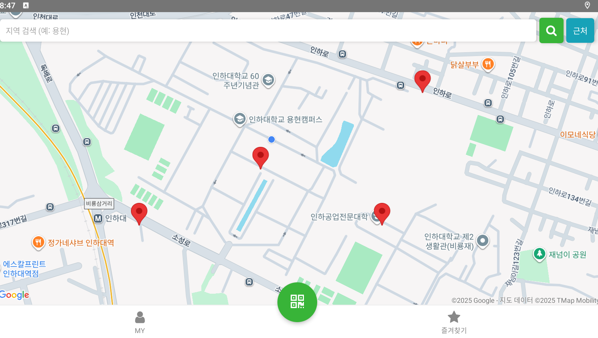
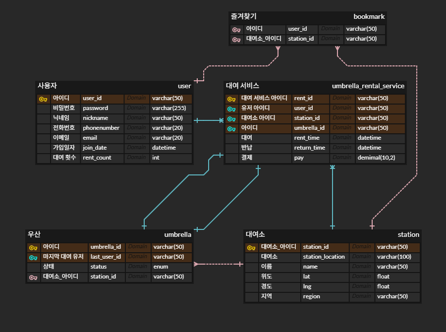

# ☔ 우산 대여 서비스 빌리傘 (Umbrella_Sharing_Service)

갑작스러운 비 소식에도 걱정 없이, 내 주변 대여소에서 손쉽게 우산을 빌리고 반납할 수 있는 **크로스 플랫폼 모바일 애플리케이션**입니다.

## 🛠️ Tech Stack

| 분류 | 기술 (Stack) |
| :--- | :--- |
| **Frontend** | React Native (JavaScript) |
| **Backend** | Node.js |
| **Database** | MySQL |
| **Tool / IDE** | Visual Studio Code, Android Studio, MySQL Workbench |

## ✨ Key Features

* **회원 기능:** 이메일 중복 확인 및 비밀번호 암호화(Hash)를 통한 안전한 회원가입/로그인
* **지도 서비스:** 사용자 위치 기반 대여소 검색 및 길 안내
* **대여/반납:** QR 코드 또는 고유 ID를 통한 간편한 우산 대여 및 반납 프로세스
* **즐겨찾기:** 자주 가는 대여소 저장 및 관리
* **상태 관리:** 우산 상태(파손/분실 등)에 따른 대여 제한 로직 구현

## 📅 Project Period
* **2025.08.27 ~ 2025.12.15** (총 16주)

### 🗺️ 메인 화면

### ERD 사진

본 서비스의 핵심 데이터 구조는 사용자(User), 우산(Umbrella), 대여소(Station), 즐겨찾기(Favorite) 엔티티로 구성되어 있으며,
이들을 연결하는 중심 테이블로 **대여 서비스(Umbrella_Rental_Service)**를 설계하였습니다.

*Station 테이블에는 위도·경도 기반의 위치 정보를 저장하여
  사용자 주변 대여소 검색 및 실시간 지도 표시 기능을 지원합니다.

*Umbrella 테이블에는 우산의 상태 정보(정상 / 파손 / 분실)를 포함하여
  대여 가능 여부를 제어하고 수량 관리를 가능하게 했습니다.

*Umbrella_Rental_Service 테이블을 통해 대여 및 반납 이력을 관리하여
  사용자–우산–대여소 간의 관계를 명확히 추적할 수 있도록 설계했습니다.

*Favorite 테이블은 사용자별 즐겨찾기 대여소 정보를 독립적으로 관리하여
  개인화된 즐겨찾기 기능을 구현했습니다.

이와 같은 구조를 통해 데이터 무결성 유지, 확장성 확보,
그리고 대여 상태의 일관된 관리가 가능하도록 설계하였습니다.

개발팀 (Team)
박계윤 (202244041) - Backend, Database 
김형철 (202244090) - Frontend, UI/UX Design
